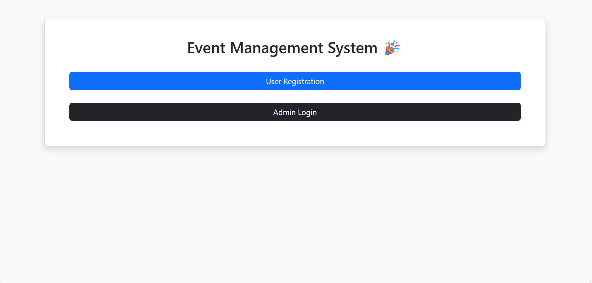
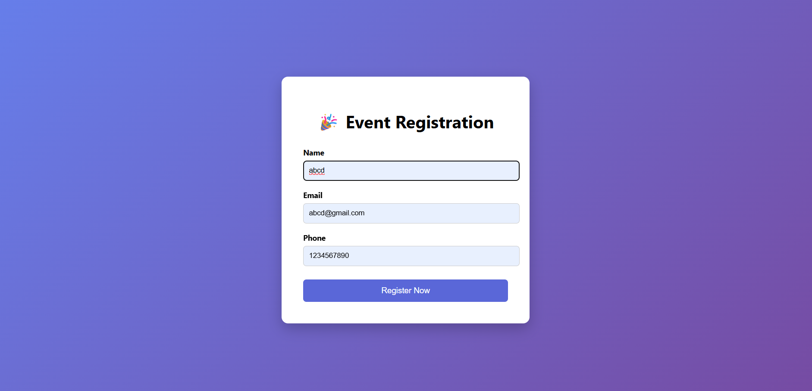
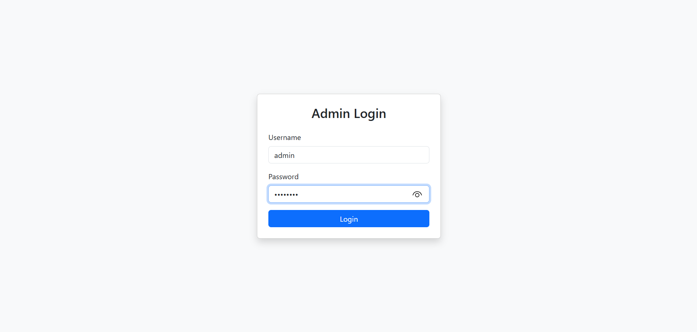
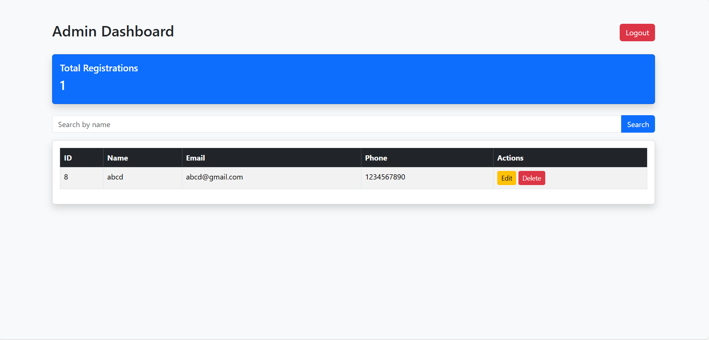

# 🎉 Event Registration System

A Flask-based web application that allows users to register for events and enables an admin to manage registrations efficiently.

---

## 🚀 Features

- 📝 User Event Registration
- 🔐 Admin Login System
- 📊 Admin Dashboard
- ✏️ Edit & Delete Registrations
- 🔎 View All Registered Users
- 🔢 Total Registration Counter
- 🔒 Environment Variable Security (.env)
- 🌐 Version Controlled with Git & GitHub

---

## 🛠 Tech Stack

- Python
- Flask
- MySQL
- HTML
- CSS / Bootstrap
- Git & GitHub

---

## 📸 Application Screenshots

### 🏠 Home Page


---

### 📝 Registration Page


---

### 🔐 Admin Login


---

### 📊 Admin Dashboard


---

## ⚙️ Installation Guide

### 1️⃣ Clone Repository

```bash
git clone https://github.com/Himangshu54/event-registration-system.git
cd event-registration-system